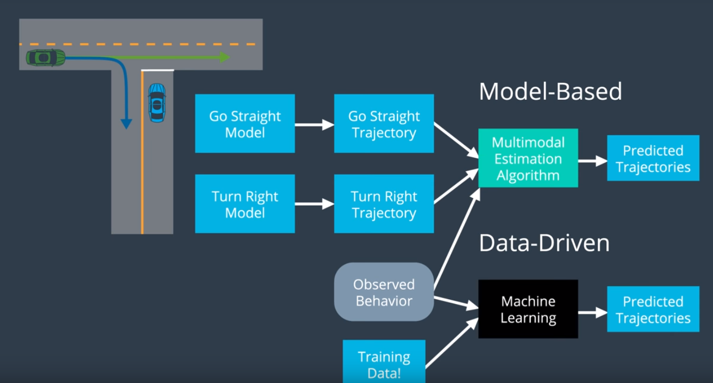

## Prediction

Map + Sensor Fusion Data --> Prediction Module --> Predictions

## Introduction and Overview
a. High Level Overview
b. Inputs and Outputs

## How Prediction is Done
a. Model based vs Data-Driven
b. Data-driven approach example : Trajectory Clustering
c. Model based : Process Models, Multi-modal estimators

## Hybrid Approach
a. Intent Classification -> Trajectory Generation
b. Naive Bayes

## Model Based Approach (Self driving car at junction,
car coming from the left)

* Compare the model trajectory (expected trajectory)with the observed trajectory,
  then assign a probability to each of the possible trajectory
