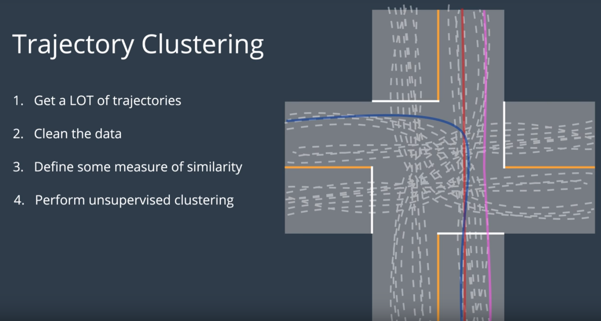
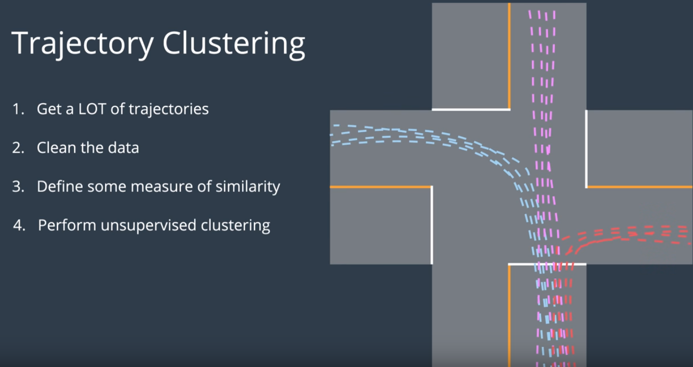
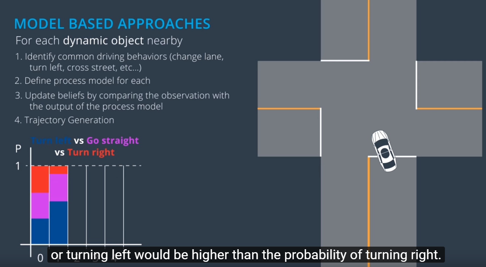

## Prediction

Map + Sensor Fusion Data --> Prediction Module --> Predictions

## Introduction and Overview
a. High Level Overview
b. Inputs and Outputs

## How Prediction is Done
a. Model based vs Data-Driven
b. Data-driven approach example : Trajectory Clustering
c. Model based : Process Models, Multi-modal estimators

## Hybrid Approach
a. Intent Classification -> Trajectory Generation
b. Naive Bayes

## Prediction Model (Self driving car at junction,
car coming from the left)

* Compare the model trajectory (expected trajectory)with the observed trajectory,
  then assign a probability to each of the possible trajectory

## Data Driven Approach
### Trajectory Clustering

a.Get a lot of trajectories. Collect data from a traffic intersection
b.Clean the data
c.Define some measure of similarity (Red and Pink line are more similar even though the blue and red line overlaps)
d.To perform clustering on trajectories. Perform unsupervised clustering (ML Algorithm to consider algomerative clustering or spectral clustering). Expect 12 clustering = 4 lanes x 3 (left, right and straight)

e.Define prototype trajectories for each cluster
!(Define prototype model)(Define_Prototype_Clustering.png)

At this point there is a model trajectory, the next step is to use this model on the road to actually generate predictions

## Model Based Approaches

For each dynamic object nearby
a. Identify common driving behaviours(change lane, turn left, cross street and etc)
b. Define process model for each behaviour. A mathematical model for description of object motion.
   Incorporated some uncertainty in the process model.
c. Update beliefs by comparing the observation with the output of the process model. Use the process model to compute the probability of each behaviour.Done by taking the observation at t-1 running the process models to compute the expected state of object at time t.
d. Trajectory generation. Compare the observed state at time t with what the process models predicted. USe a multimodal estimation algorithm
to derive the probability of each maneuver.
